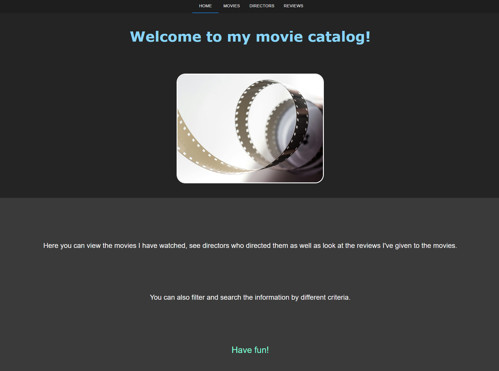
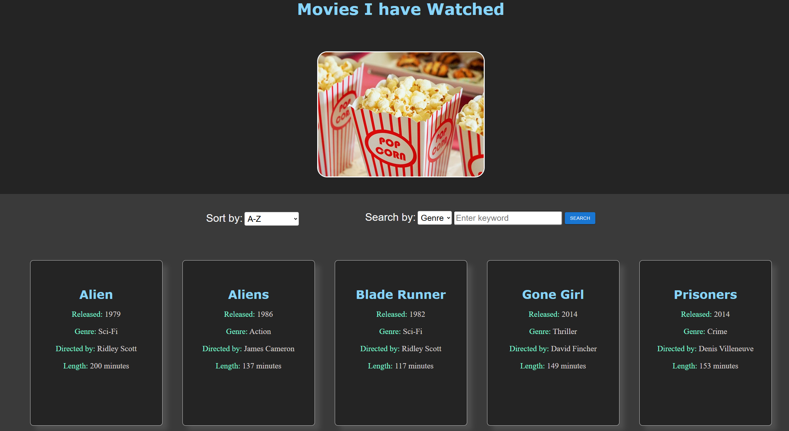
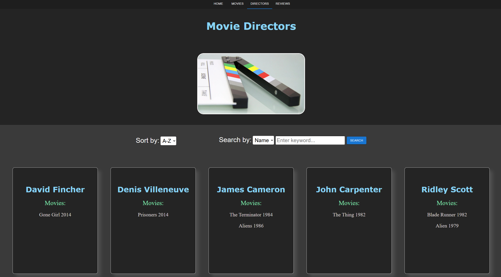
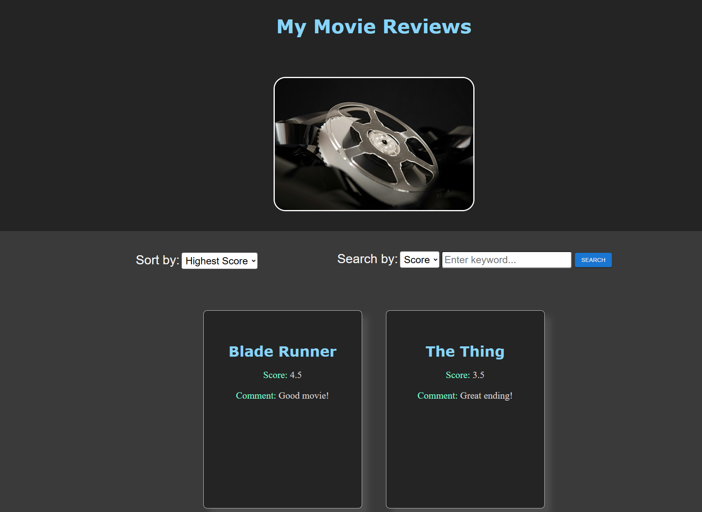

# Movie Catalog Frontend

## Overview
Public frontend for my movie catalog application. Mostly made for learning useReducer React hook and using TypeScript with React.

## Application Screenshots
<div style="display: flex; flex-wrap: wrap; gap: 10px;">
  
  
  
  
</div>

## Features
- **Sorting**: User can sort data based on selected criteria like release year.
- **Filtering**: User can filter the data based in criteria like name.

## Backend

- There is a backend which is meant to be used alongside this application.
- Backend repository: https://github.com/joakha/Movie-Catalog.

## Installation

1. Install and run the backend:
    ```sh
    https://github.com/joakha/Movie-Catalog
    ```

1. Clone this repository:
    ```sh
    git clone https://github.com/joakha/movie-catalog-front-ts.git
    ```

2. Install dependencies:
    ```sh
    npm install
    ```

3. Environment Variables:
    1. Create a file called .env to the cloned project root.
    2. Add following following variable VITE_DB_URL. It's value should be your postgres database host name and port e.g. "localhost:5432".

4. Start development server:
    ```sh
    npm run dev
    ```

## Dependencies

1. @emotion/react - A library for writing CSS styles with JavaScript, optimized for React.
2. @emotion/styled - A styled-components-like API for Emotion, allowing styled component creation.
3. @mui/material - Material-UI components for building a modern and accessible UI in React.
